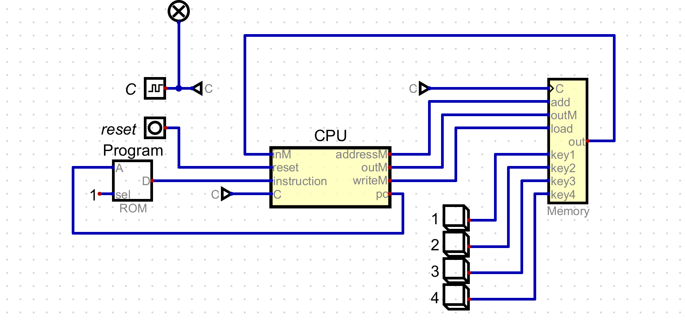
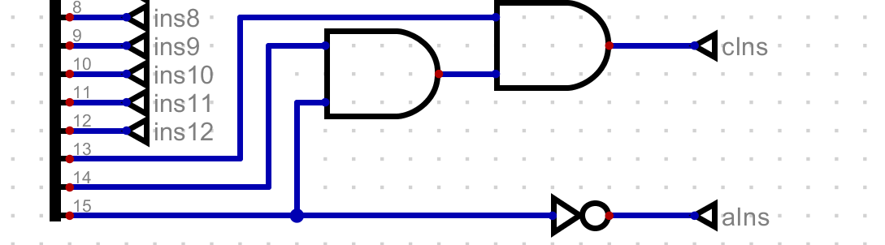

# Unidad 1
## Conceptos generales de procesadores 

## Conceptos de Arquitectura de Computadoras

### 1. CPU (Central Processing Unit)
La Unidad Central de Procesamiento (CPU) es el cerebro de la computadora, responsable de ejecutar instrucciones de programas a través de la interpretación de códigos de máquina. La CPU realiza operaciones aritméticas, lógicas, de control y de entrada/salida.

### 2. ALU (Arithmetic Logic Unit)
La Unidad Aritmética y Lógica (ALU) es una parte fundamental de la CPU que realiza operaciones aritméticas (suma, resta, etc.) y lógicas (AND, OR, NOT). Es esencial para la ejecución de cálculos y operaciones lógicas dentro del procesador.

### 3. Registros
Los registros son pequeñas unidades de almacenamiento dentro de la CPU que almacenan datos temporales y direcciones.

#### a. Registros de propósito general
Son registros que pueden ser utilizados por el programador para almacenar datos temporales durante la ejecución de programas.

#### b. Registros específicos: Program Counter, Stack Pointer, etc.
- **Program Counter (PC):** Mantiene la dirección de la siguiente instrucción a ejecutar.
- **Stack Pointer (SP):** Apunta a la cima de la pila, usada para gestionar llamadas a funciones y operaciones de pila.

### 4. Unidad de control
La unidad de control es responsable de dirigir las operaciones de la CPU al decodificar las instrucciones y generar las señales de control necesarias para coordinar la ejecución de instrucciones por parte de la ALU y otros componentes.

### 5. Buses de datos y de dirección
Los buses son canales de comunicación que transportan información entre los distintos componentes de la computadora.

- **Bus de datos:** Transporta datos entre la memoria y la CPU.
- **Bus de dirección:** Transporta las direcciones de memoria donde se almacenarán o recuperarán datos.

### 6. Memoria
La memoria es el componente que almacena datos e instrucciones que la CPU necesita para ejecutar programas. Se divide en memoria primaria (RAM, ROM) y memoria secundaria (discos duros, SSDs).

### 7. Opcode
El código de operación (opcode) es la parte de una instrucción de máquina que especifica la operación que debe realizar la CPU. Cada opcode corresponde a una operación específica como suma, resta, carga, etc.

## Bibliografía
- Stallings, W. (2018). *Computer Organization and Architecture: Designing for Performance* (11th Edition). Pearson.
- Tanenbaum, A. S., & Austin, T. (2012). *Structured Computer Organization* (6th Edition). Pearson.
- Patterson, D. A., & Hennessy, J. L. (2017). *Computer Organization and Design: The Hardware/Software Interface* (5th Edition). Morgan Kaufmann.
- Mano, M. M., & Kime, C. R. (2013). *Logic and Computer Design Fundamentals* (5th Edition). Pearson.

## Funcionamiento de la simulación 16 bits
El pc cuenta con una arquitectura Harvard, esto debido a que tiene dos memorias ubicadas en diferente sitio. Una destinada para las instrucciones y otra para los datos. En este caso específico la memoria ROM almacena el programa a ejecutarse, esta cuenta con tres registros, D, A y PC. a través del registro D se transmiten las instrucciones, mientras que el registro A las direcciones de memoria de dichas instrucciones, las cuales son dictadas por el registro PC. La CPU se encarga de los procesos de fetch, decode and execute. el bloque memory se encarga de almacenar los datos. 

## Fetch-decode-execute
El proceso Fetch-decode-execute resume a grosso modo el funcionamiento de un procesador a escala más básica. Por ejemplo en la computadora de 16 bits la CPU primero tiene que buscar la dirección de la instrucción en el registro A dictada por el registro pc. Luego la CPU decodifica la instrucción, finalmente la envía para su ejecución a través del registro D. 

## Resumen de las instrucciones

En este ejemplo existen dos tipos de instrucciones: A y C. La instrucción tipo A viene dictada por el registro PC y se encarga de escribir en el registro A la dirección de la memoria en la cual se encuentra la instrucción para que luego el contenido sea mostrado en el registro D. Las instrucciones tipo A tienen su bit más significativo siempre en 0. Por ejemplo la instrucción 0x4000, la cual guarda en el registro A el número 0x4000. Por otro lado la instrucción tipo C está compuesto de tres partes, un encabezado conformado por los tres primeros bits, los cuales siempre estarán en 1. Luego vienen 7 bits que determinan la operación a realizar, siguiendo la forma **destino=operación**. Por ejemplo D=A, que almacena en D la información que se encuentra en el registro A. Finalmente los últimos tres bits se encargan de modificar el flujo del programa, también conocidos como saltos. Si no existiera la posibilidad de modificar el flujo del programa no tendría sentido el uso del registro PC, pues el programa se ejecutaría de manera secuencial. En resumen, el registro C sigue la forma **111destino=operación;salto**  

## Proceso de decodificación
Para saber si ua instrucción es de tipo A o de tipo C la CPU usa una decodificación por hardware. Como podemos ver en la imagen, el bit más significativo va a una compuerta negadora. Es decir, cuando la instrucción es de tipo A, el bit más signficativo va a ser un 0, por lo tanto aIns será un 1, correspondiente a la instrucción tipo A. en el caso contrario los tres bits más significativos serán 1, por lo que aIns será 0, mientras que cIns será 1.

## resultado del ejercicio

Al ejecutar el código en assembler se evidencia que suma los números del 1 al 100 y los almacena en la variable sum.

# Actividad 2: Mapa de Memoria y Set de Instrucciones

## Resumen  de las Ideas Principales

se explora la arquitectura y el funcionamiento de los microprocesadores MC6808 y MC6802, centrándose en el concepto de mapa de memoria y el conjunto de instrucciones. Un mapa de memoria organiza y distribuye las secciones de memoria (RAM, ROM y periféricos), permitiendo que el procesador acceda eficientemente a los datos y programas necesarios.

### Mapas de Memoria
- **MC6808:** Utiliza un espacio de direcciones de 64 KB, donde las direcciones bajas suelen estar ocupadas por RAM y las altas por ROM. Los periféricos están mapeados en un rango específico dentro de este espacio.
- **MC6802:** Similar al MC6808, pero con variaciones en la disposición de memoria interna y periféricos. Este procesador también dispone de un espacio de direcciones de 64 KB.

### Set de Instrucciones
Las instrucciones básicas de estos microprocesadores incluyen operaciones como MOV (transferencia de datos), ADD (suma), y SUB (resta). Estas instrucciones se analizan en términos de longitud (en bytes), ciclos de reloj necesarios para su ejecución, y complejidad. El análisis comparativo proporciona una comprensión de cómo diferentes instrucciones afectan el rendimiento general del sistema.

## Investigación de un Procesador Diferente

### Procesador: ARM Cortex-M4

**Características de la Arquitectura:**
- **Arquitectura:** Harvard, lo que permite accesos simultáneos a las memorias de instrucciones y de datos, mejorando el rendimiento.

**Mapa de Memoria:**
- **Memoria de Código:** 0x00000000 - 0x1FFFFFFF
- **SRAM:** 0x20000000 - 0x3FFFFFFF
- **Periféricos:** 0x40000000 - 0x5FFFFFFF
- **Memoria Externa:** 0x60000000 - 0x9FFFFFFF
- **Registros del Sistema:** 0xE0000000 - 0xE00FFFFF

La separación física de las memorias en la arquitectura Harvard del ARM Cortex-M4 permite accesos más rápidos y eficientes, mejorando el rendimiento global del procesador.

## Consulta de Tres Microprocesadores Diferentes

### Microprocesadores:

1. **Intel 8086**
   - **Instrucciones:** MOV, ADD, SUB
   - **Longitud:** MOV (2-4 bytes), ADD (3 bytes), SUB (3 bytes)
   - **Ciclos de Reloj:** MOV (2-4), ADD (3-4), SUB (3-4)
   - **Complejidad:** Baja a media

2. **Zilog Z80**
   - **Instrucciones:** LD (equivalente a MOV), ADD, SUB
   - **Longitud:** LD (1 byte), ADD (1 byte), SUB (1 byte)
   - **Ciclos de Reloj:** LD (4), ADD (4), SUB (4)
   - **Complejidad:** Baja

3. **Motorola 68000**
   - **Instrucciones:** MOVE (equivalente a MOV), ADD, SUB
   - **Longitud:** MOVE (2-4 bytes), ADD (2-4 bytes), SUB (2-4 bytes)
   - **Ciclos de Reloj:** MOVE (4-20), ADD (4-20), SUB (4-20)
   - **Complejidad:** Media

### Comparación de Instrucciones

1. **MOV/LD/MOVE**
   - **Intel 8086:** Longitud 2-4 bytes, ciclos 2-4, complejidad baja-media.
   - **Zilog Z80:** Longitud 1 byte, ciclos 4, complejidad baja.
   - **Motorola 68000:** Longitud 2-4 bytes, ciclos 4-20, complejidad media.

2. **ADD**
   - **Intel 8086:** Longitud 3 bytes, ciclos 3-4, complejidad baja-media.
   - **Zilog Z80:** Longitud 1 byte, ciclos 4, complejidad baja.
   - **Motorola 68000:** Longitud 2-4 bytes, ciclos 4-20, complejidad media.

3. **SUB**
   - **Intel 8086:** Longitud 3 bytes, ciclos 3-4, complejidad baja-media.
   - **Zilog Z80:** Longitud 1 byte, ciclos 4, complejidad baja.
   - **Motorola 68000:** Longitud 2-4 bytes, ciclos 4-20, complejidad media.

### Conclusiones

1. **Longitud de Instrucciones:** La longitud varía según el diseño del procesador. Los procesadores más antiguos y simples, como el Zilog Z80, tienden a tener instrucciones más cortas.
2. **Ciclos de Reloj:** Los ciclos de reloj necesarios para ejecutar una instrucción dependen de la eficiencia del procesador y su capacidad para realizar operaciones. Procesadores como el Motorola 68000, con su arquitectura más avanzada, tienden a requerir más ciclos.
3. **Complejidad:** Los procesadores más avanzados, como el Motorola 68000, manejan modos de direccionamiento y operaciones más complejas, lo que incrementa su complejidad.

## Bibliografía

1. ARM Holdings. (2010). Cortex-M4 Processor Technical Reference Manual. Recuperado de [ARM](https://developer.arm.com/documentation/ddi0439/b)
2. Intel Corporation. (1978). Intel 8086 Microprocessor Family: User’s Manual. Recuperado de [Intel](https://www.intel.com/content/dam/www/public/us/en/documents/manuals/8086-user-manual.pdf)
3. Zilog, Inc. (2004). Z80 CPU User Manual. Recuperado de [Zilog](https://www.zilog.com/docs/z80/um0080.pdf)
4. Motorola, Inc. (1993). M68000 8-/16-/32-Bit Microprocessors User’s Manual. Recuperado de [NXP](https://www.nxp.com/docs/en/user-guide/M68000UM.pdf)

